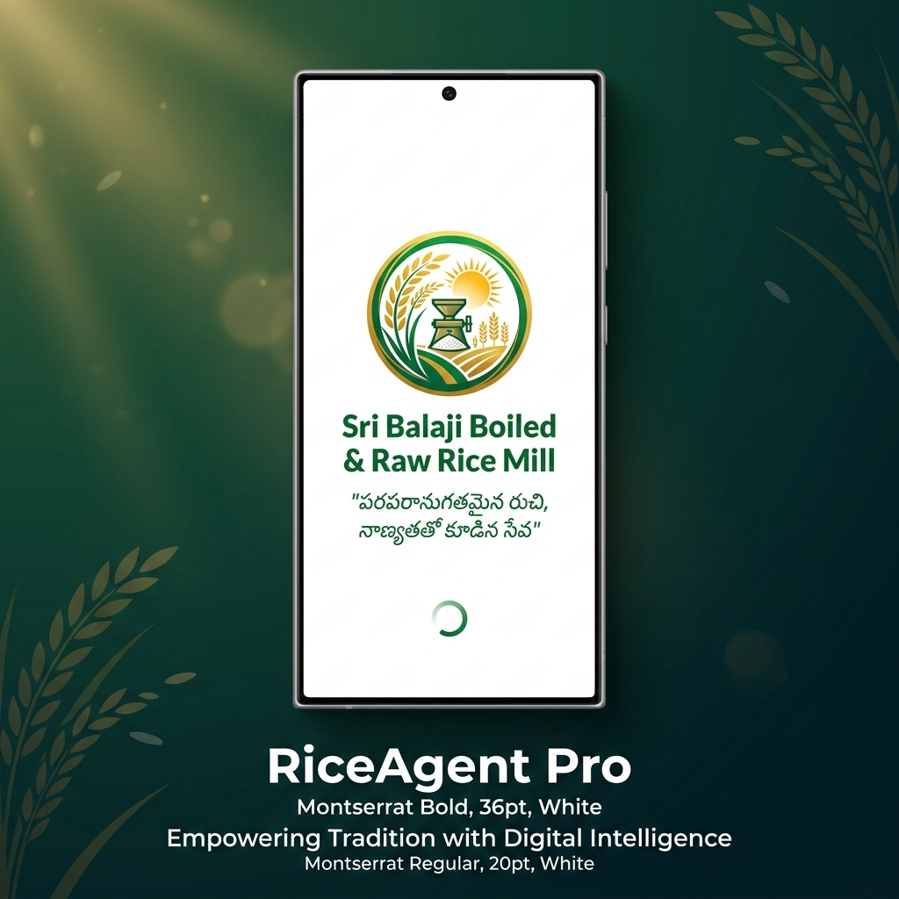
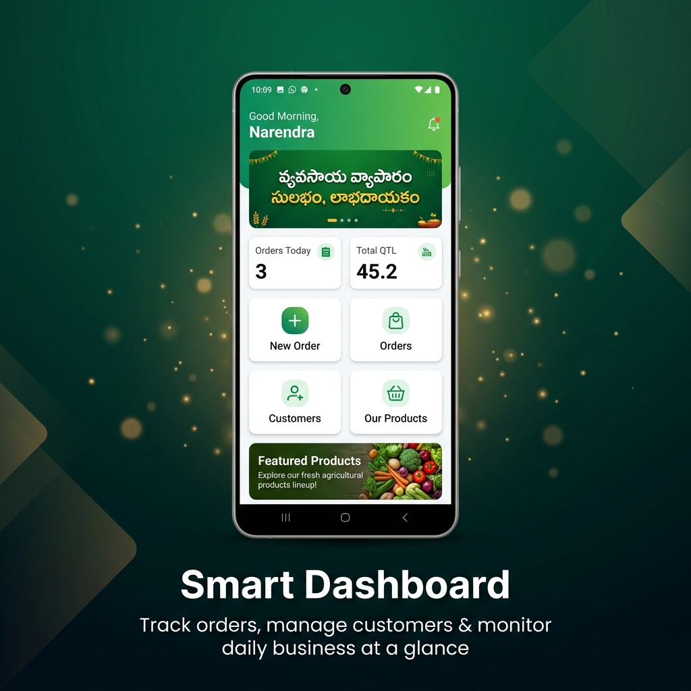
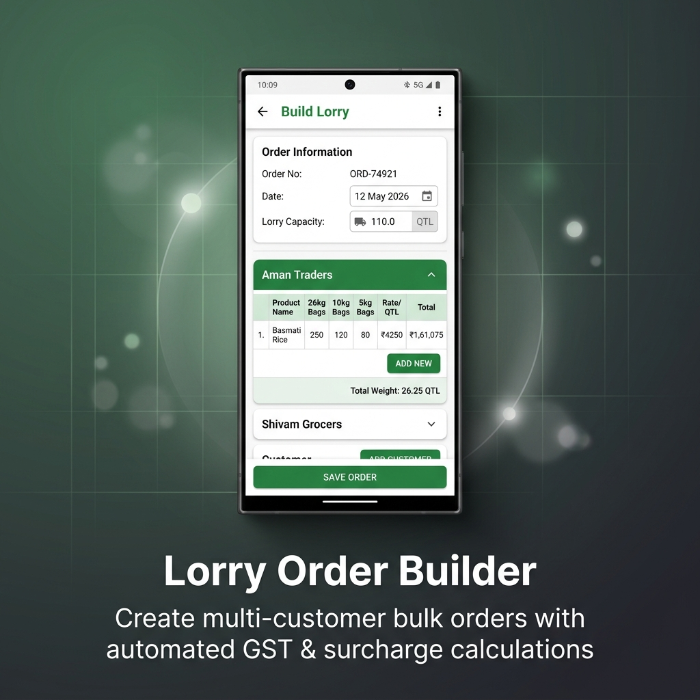
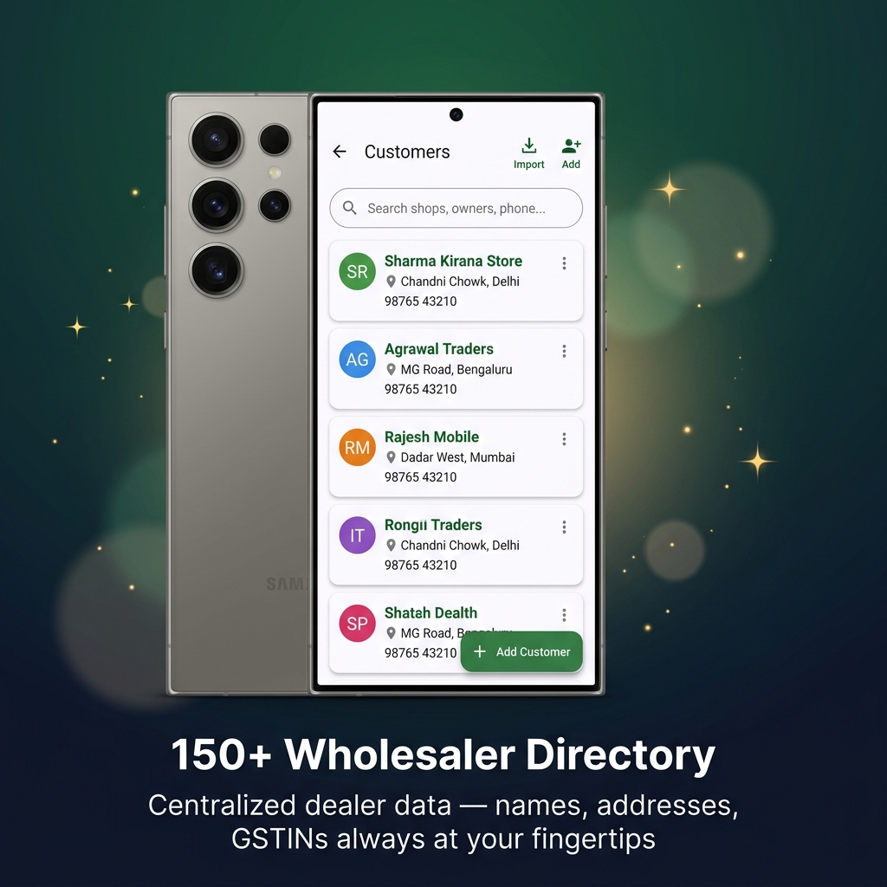
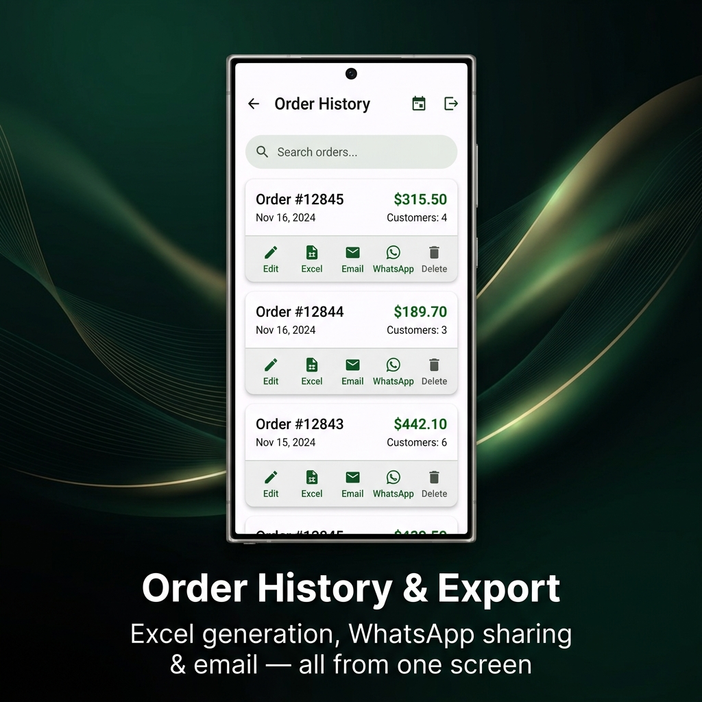
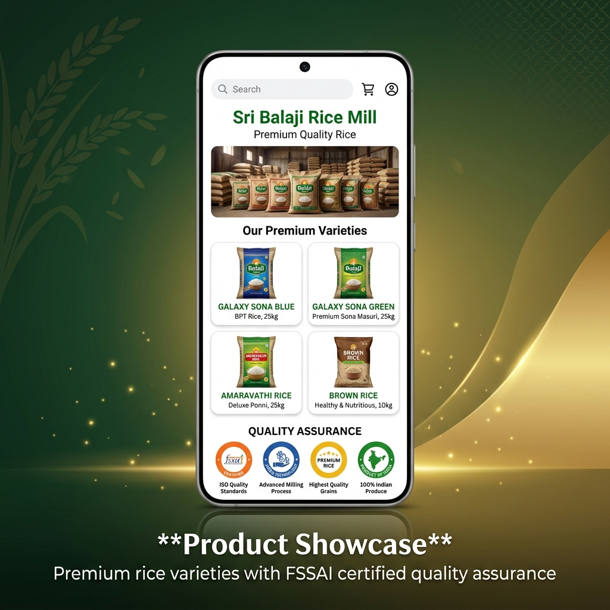
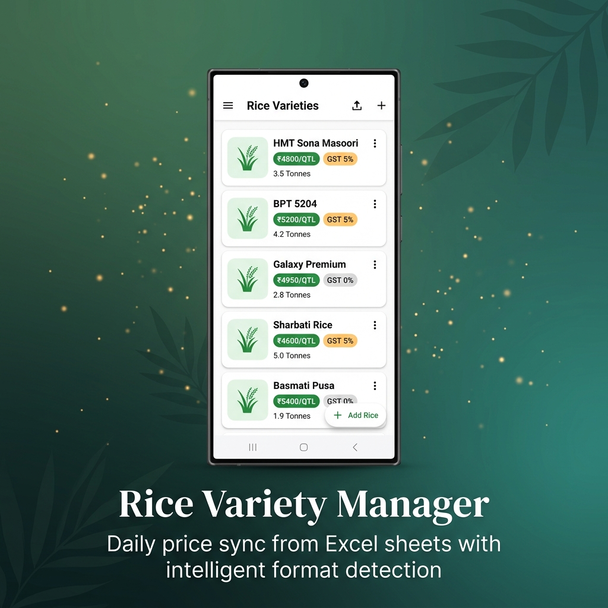
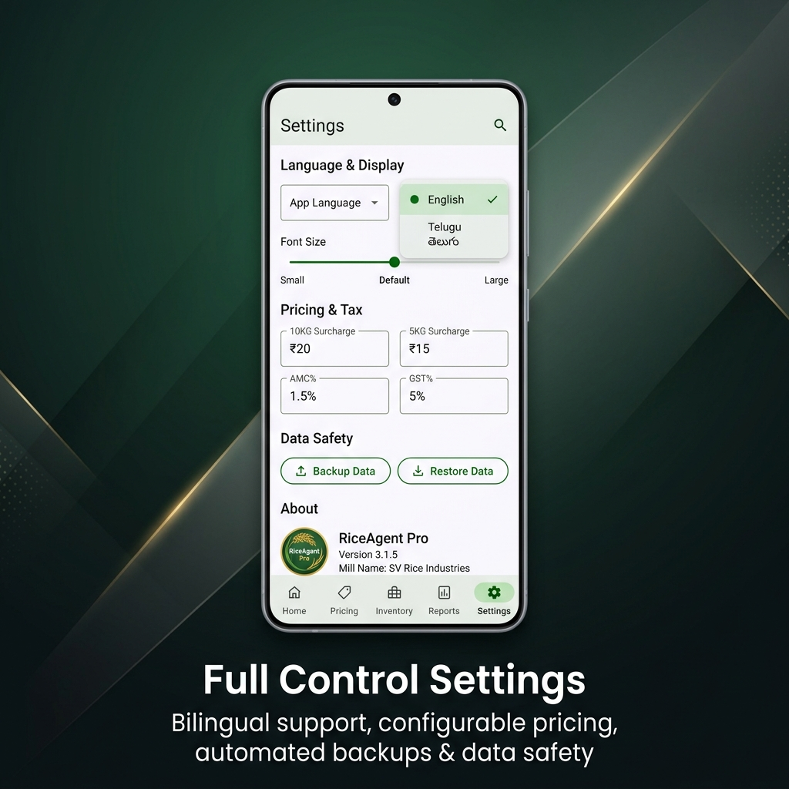
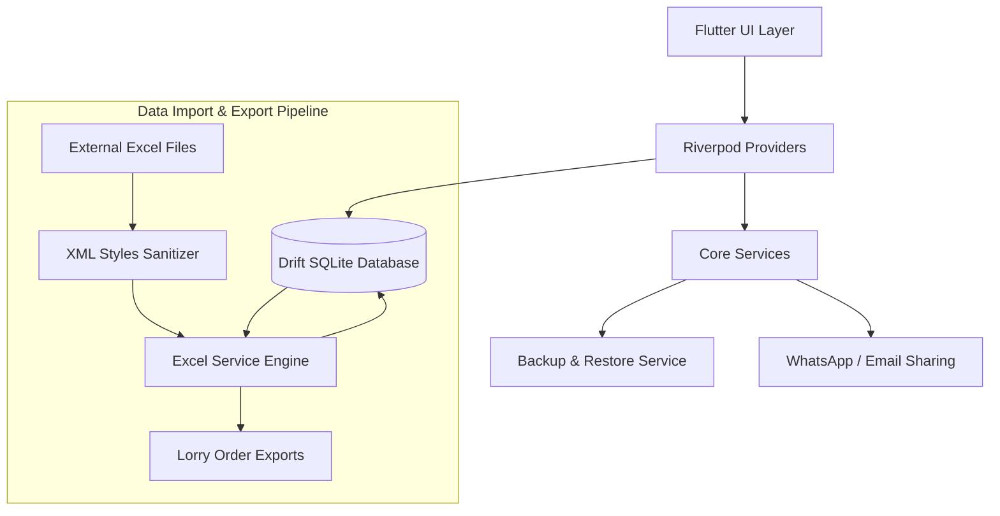

<div align="center">
  
  <h1>RiceAgent Pro</h1>
  <p><em>Empowering Tradition with Digital Intelligence</em></p>

  <!-- Badges -->
  <p>
    
    
    
    
  </p>
</div>

> *"A real project works not if it is technically strong, but only when it solves a real-time problem in a sustainable way."*

---

## 📖 Table of Contents
- [The Project Mission](#-the-project-mission)
- [App Screenshots](#-app-screenshots)
- [Key Features](#-key-features)
- [Tech Stack](#-tech-stack)
- [System Architecture](#-system-architecture)
- [Project Structure](#-project-structure)
- [Getting Started](#-getting-started)
- [Roadmap & Next Steps](#-roadmap--next-steps)
- [Author](#-author)

---

## 🎯 The Project Mission

**"I engineered RiceAgent to solve a critical operational bottleneck in my father's large-scale rice distribution business."**

Managing over 150 wholesalers and fulfilling bulk 150-quintal lorry loads previously required a constant dependency on a physical laptop and manual paperwork. 

By developing this offline-first mobile solution, I transitioned his entire office into his pocket. My father can now look up customer GSTINs, verify shop addresses, and generate professional, mill-standard order forms instantly from the field, ensuring he is always *'one step ahead'* of the supply chain.

---

## 📱 App Screenshots

<div align="center">

<table>
  <tr>
    <td align="center"><br/><b>Splash Screen</b><br/><sub>Brand identity & loading</sub></td>
    <td align="center"><br/><b>Smart Dashboard</b><br/><sub>Track orders & daily stats at a glance</sub></td>
  </tr>
  <tr>
    <td align="center"><br/><b>Lorry Order Builder</b><br/><sub>Multi-customer bulk orders with auto GST</sub></td>
    <td align="center"><br/><b>150+ Wholesaler Directory</b><br/><sub>Names, addresses, GSTINs at your fingertips</sub></td>
  </tr>
  <tr>
    <td align="center"><br/><b>Order History & Export</b><br/><sub>Excel, WhatsApp & Email from one screen</sub></td>
    <td align="center"><br/><b>Product Showcase</b><br/><sub>Premium rice varieties with FSSAI quality</sub></td>
  </tr>
  <tr>
    <td align="center"><br/><b>Rice Variety Manager</b><br/><sub>Daily price sync from Excel sheets</sub></td>
    <td align="center"><br/><b>Full Control Settings</b><br/><sub>Bilingual, pricing config & data safety</sub></td>
  </tr>
</table>

</div>

---

## ✨ Key Features

### 🏢 1. Core Business & Logistics Management
- **150+ Wholesaler Directory:** Centralizes dealer data (names, precise addresses, contacts, phone), eliminating laptop dependency.
- **Smart Customer Search:** Filter customers by Name, Place, or Phone with dedicated filter chips + alphabet scroll bar sorted by area.
- **Bulk Order Management:** Built for heavy lifting—seamlessly handles multi-customer lorry shipments with default 120 QTL capacity.
- **Master Bulk Discount Engine:** Auto-applies tiered discounts — ₹50/qtl (50+ QTL total) or ₹75/qtl (100+ QTL total) on GALAXY varieties, plus ₹100/qtl exclusive discount on any single variety reaching 100 QTL.
- **Galaxy Variety Management:** Mark any rice variety as GALAXY via toggle; discount eligibility auto-detected and stored in DB.
- **Dynamic Surcharges:** Automatically bills complex orders via industrial surcharges (₹200/Qtl for 10kg, ₹250/Qtl for 5kg).
- **GST-Compliant Billing:** Auto-calculates tax rates (e.g., 5% branded vs. 0% exempted 26kg bags).

### 📡 2. Advanced Data Services
- **Offline-First Reliability:** Fully functional SQLite (Drift) backend guarantees zero downtime in network dead-zones.
- **Intelligent Excel Import:** A flexible header-detection system dynamically parses varied formats (e.g., "GSTIN" or "PACKING IN KGS") with phone number sanitization.
- **Automated Backups:** Silently backs up databases on startup and retains the last 5 states to prevent data loss.
- **Deleted Data Audit:** Deleted customers and varieties are logged to Excel files saved at your configured settings path.
- **Smart Product Seeding:** Pre-loaded with 15 standard rice varieties (HMT, BPT, Sona) marked with GALAXY flag where applicable.

### ⚡ 3. Operational Efficiency
- **Mill-Standard Exports:** Generates professional `.xlsx` order forms matching the exact visual alignment demanded by mills, saved to your custom folder.
- **WhatsApp Integration:** Send lorry summaries to mill + individual PDF invoices per customer with text message fallback option.
- **Daily Price Sync:** Rapidly imports mill-style sheets with "EXEMPTED" and "GST 5%" segment recognition.
- **Tomorrow-First Default:** Orders page defaults loading date filter to tomorrow; new orders preset to next day.
- **Order QTL Analytics:** View per-item, per-customer, per-variety, and total QTL breakdowns in order details.

### 🛡️ 4. System Stability & UX
- **Robust Error Handling:** Employs `runZonedGuarded` and strict ErrorBoundaries to prevent crashes during critical tasks.
- **XML Data Sanitization:** Custom parsing engine neutralizes `invalid numFmtId` crashes from LibreOffice/WPS Excel files.
- **Professional Aesthetics:** Modern, premium UI equipped with font scaling and multi-language support (English, Telugu, Hindi, Tamil).
- **Custom Save Location:** All Excel exports (orders, deleted records) saved to user-defined directory from Settings.

### 📊 5. Interactive Business Analytics
- **Visual Dashboards:** Embedded `fl_chart` integration provides a premium Business Analytics dashboard directly in the app.
- **Daily Orders & Revenue:** Interactive Bar Charts displaying daily trends, toggleable between Orders, Revenue, and Quantity.
- **Variety Demand Tracking:** Beautiful Donut Pie Charts illustrating exact rice variety distribution and market demand.
- **Smart Reactive Filters:** Ultra-fast, in-memory filtering (Last 7/30 Days, Monthly, Yearly) powered by Riverpod and Drift reactive streams.

---
## 🛠️ Tech Stack

- **Framework:** [Flutter](https://flutter.dev/) (Cross-platform mobile)
- **Language:** Dart
- **State Management:** [Riverpod](https://riverpod.dev/) (Predictable, reactive caching)
- **Local Database:** [Drift](https://drift.simonbinder.eu/) (Type-safe SQLite ORM)
- **Excel Processing:** `excel` package (with custom XML patching)
- **Device Integration:** `share_plus`, `url_launcher` (WhatsApp/Email routing)

---

## 🏗️ System Architecture

The application follows a clean, offline-first architecture separating the UI layer from heavy data-processing tasks.



---

## 📁 Project Structure

```text
lib/
├── db/                     # Drift SQLite schema and migrations
│   ├── database.dart       # Core AppDatabase definition
│   └── tables.dart         # Table definitions (Products, Customers, Orders)
├── features/               # Feature-based modular code
│   └── analytics/          # Business analytics models, providers, and charts
├── providers/              # Riverpod state management providers
│   └── settings_provider.dart # Application settings and active surcharges
├── screens/                # Flutter UI screens
│   ├── new_order_screen.dart   # Complex Lorry order generation flow
│   ├── orders_screen.dart      # History and export management
│   ├── product_gallery_screen.dart # Visual product catalog
│   └── settings_screen.dart    # App configuration & UI
├── services/               # Core business logic and integrations
│   ├── backup_service.dart # Automated local DB backup/restore
│   ├── email_service.dart  # Email intent integration
│   ├── excel_service.dart  # Custom Excel parsing and generation engine
│   └── whatsapp_service.dart # WhatsApp Business sharing integration
├── widgets/                # Reusable UI components
│   └── safe_widgets.dart   # Layout-safe wrappers preventing overflows
├── main.dart               # Application entry point
└── theme.dart              # Global application design system
```

---

## 🚀 Getting Started

### Prerequisites
- Flutter SDK (`>=3.0.0`)
- Dart SDK
- Android Studio / VS Code with Flutter extensions

### Installation

1. **Clone the repository**
   ```bash
   git clone https://github.com/yourusername/RiceAgent.git
   cd RiceAgent/mobile/flutter_app
   ```

2. **Install dependencies**
   ```bash
   flutter pub get
   ```

3. **Generate Drift Database Files**
   ```bash
   dart run build_runner build --delete-conflicting-outputs
   ```

4. **Run the App**
   ```bash
   flutter run
   ```

---

## 🔮 Roadmap & Next Steps

- ✅ **WhatsApp Integration** — Lorry summaries & individual PDF invoices with text fallback
- ✅ **Bulk Discount Engine** — Tiered GALAXY discounts with override logic
- ✅ **Custom Save Path** — All exports to user-defined location
- ✅ **Advanced Analytics** — Interactive dashboards for sales trends and variety-wise popularity
- 🔲 **Cloud Synchronization** — Low-bandwidth sync for multi-device support between field agents and mill desktop
- 🔲 **Payment Tracking** — Track partial/full payments per customer per order

---

## 👨‍💻 Author

**Ganesh**  
*Transforming real-world traditional businesses through robust software engineering.*

---
*Note: This repository contains proprietary business logic tailored for Sri Balaji Boiled and Raw Rice Mill.*
