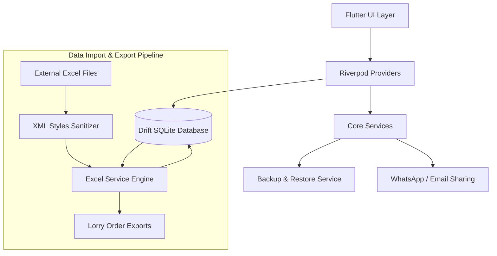

<div align="center">
  
  <h1>RiceAgent Pro</h1>
  <p><em>Empowering Tradition with Digital Intelligence</em></p>

  <!-- Badges -->
  <p>
    
    
    
    
  </p>
</div>

> *"A real project works not if it is technically strong, but only when it solves a real-time problem in a sustainable way."*

---

## 📖 Table of Contents
- [The Project Mission](#-the-project-mission)
- [Key Features](#-key-features)
- [Tech Stack](#-tech-stack)
- [System Architecture](#-system-architecture)
- [Project Structure](#-project-structure)
- [Getting Started](#-getting-started)
- [Roadmap & Next Steps](#-roadmap--next-steps)
- [Author](#-author)

---

## 🎯 The Project Mission

**"I engineered RiceAgent to solve a critical operational bottleneck in my father's large-scale rice distribution business."**

Managing over 150 wholesalers and fulfilling bulk 150-quintal lorry loads previously required a constant dependency on a physical laptop and manual paperwork. 

By developing this offline-first mobile solution, I transitioned his entire office into his pocket. My father can now look up customer GSTINs, verify shop addresses, and generate professional, mill-standard order forms instantly from the field, ensuring he is always *'one step ahead'* of the supply chain.

---

## ✨ Key Features

### 📸 Feature Showcases
| Core Business Management | Advanced Data Services |
| :---: | :---: |
|  |  |
| **Operational Efficiency** | **System Stability & UX** |
|  |  |
> *(Note: Replace placeholder image paths with actual feature demonstration GIFs)*

### 🏢 1. Core Business & Logistics Management
- **150+ Wholesaler Directory:** Centralizes dealer data (names, precise addresses, contacts), eliminating laptop dependency.
- **Bulk Order Management:** Built for heavy lifting—seamlessly handles multi-customer 150-quintal lorry shipments.
- **Dynamic Surcharges:** Automatically bills complex orders via industrial surcharges (₹200/Qtl for 10kg, ₹250/Qtl for 5kg).
- **GST-Compliant Billing:** Auto-calculates tax rates (e.g., 5% branded vs. 0% exempted 26kg bags).

### 📡 2. Advanced Data Services
- **Offline-First Reliability:** Fully functional SQLite (Drift) backend guarantees zero downtime in network dead-zones.
- **Intelligent Excel Import:** A flexible header-detection system dynamically parses varied formats (e.g., "GSTIN" or "PACKING IN KGS").
- **Automated Backups:** Silently backs up databases on startup and retains the last 5 states to prevent data loss.
- **Smart Product Seeding:** Pre-loaded with standard rice varieties (HMT, BPT, Sona) for immediate operational readiness.

### ⚡ 3. Operational Efficiency
- **Mill-Standard Exports:** Generates professional `.xlsx` order forms matching the exact visual alignment demanded by mills.
- **WhatsApp Integration (Planned):** Instant generation and delivery of order summaries to shop owners to close the communication loop.
- **Daily Price Sync:** Rapidly imports mill-style sheets with "EXEMPTED" and "GST 5%" segment recognition.

### 🛡️ 4. System Stability & UX
- **Robust Error Handling:** Employs `runZonedGuarded` and strict ErrorBoundaries to prevent crashes during critical tasks.
- **XML Data Sanitization:** Custom parsing engine neutralizes `invalid numFmtId` crashes from LibreOffice/WPS Excel files.
- **Professional Aesthetics:** Modern, premium UI equipped with font scaling and multi-language support (English & Telugu).

---
## 🛠️ Tech Stack

- **Framework:** [Flutter](https://flutter.dev/) (Cross-platform mobile)
- **Language:** Dart
- **State Management:** [Riverpod](https://riverpod.dev/) (Predictable, reactive caching)
- **Local Database:** [Drift](https://drift.simonbinder.eu/) (Type-safe SQLite ORM)
- **Excel Processing:** `excel` package (with custom XML patching)
- **Device Integration:** `share_plus`, `url_launcher` (WhatsApp/Email routing)

---

## 🏗️ System Architecture

The application follows a clean, offline-first architecture separating the UI layer from heavy data-processing tasks.



---

## 📁 Project Structure

```text
lib/
├── db/                     # Drift SQLite schema and migrations
│   ├── database.dart       # Core AppDatabase definition
│   └── tables.dart         # Table definitions (Products, Customers, Orders)
├── providers/              # Riverpod state management providers
│   └── settings_provider.dart # Application settings and active surcharges
├── screens/                # Flutter UI screens
│   ├── new_order_screen.dart   # Complex Lorry order generation flow
│   ├── orders_screen.dart      # History and export management
│   ├── product_gallery_screen.dart # Visual product catalog
│   └── settings_screen.dart    # App configuration & UI
├── services/               # Core business logic and integrations
│   ├── backup_service.dart # Automated local DB backup/restore
│   ├── email_service.dart  # Email intent integration
│   ├── excel_service.dart  # Custom Excel parsing and generation engine
│   └── whatsapp_service.dart # WhatsApp Business sharing integration
├── widgets/                # Reusable UI components
│   └── safe_widgets.dart   # Layout-safe wrappers preventing overflows
├── main.dart               # Application entry point
└── theme.dart              # Global application design system
```

---

## 🚀 Getting Started

### Prerequisites
- Flutter SDK (`>=3.0.0`)
- Dart SDK
- Android Studio / VS Code with Flutter extensions

### Installation

1. **Clone the repository**
   ```bash
   git clone https://github.com/yourusername/RiceAgent.git
   cd RiceAgent/mobile/flutter_app
   ```

2. **Install dependencies**
   ```bash
   flutter pub get
   ```

3. **Generate Drift Database Files**
   ```bash
   dart run build_runner build --delete-conflicting-outputs
   ```

4. **Run the App**
   ```bash
   flutter run
   ```

---

## 🔮 Roadmap & Next Steps

**"My Strong Next:"**
Building on this robust, offline-first foundation, the next evolution involves introducing secure, **low-bandwidth cloud synchronization**. 
This will allow multi-device support (e.g., syncing orders between the field agent's phone and the mill's desktop) without compromising the critical offline capabilities required when traveling through dead zones.

---

## 👨‍💻 Author

**Ganesh**  
*Transforming real-world traditional businesses through robust software engineering.*

---
*Note: This repository contains proprietary business logic tailored for Sri Balaji Boiled and Raw Rice Mill.*
